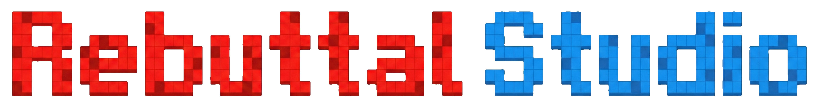

<p align="center">
  
</p>

<p align="center">
  <a href="#">
    
  </a>
  <a href="#">
    
  </a>
  <a href="#">
    
  </a>
  <a href="#">
    
  </a>
</p>

<p align="center">
  <b>A rebuttal editor for researchers to craft high-quality academic rebuttals — so you can focus on <i>what</i> to say, not <i>how</i> to format it.</b>
</p>

---

## 📖 Introduction

Writing rebuttals for academic conferences is a high-stakes, time-sensitive task. Yet, there is currently **no dedicated editor** that streamlines this process. Researchers often find themselves wrestling with formatting constraints, manually splitting reviewer comments into atomic issues, and juggling multiple response drafts across disorganized documents — all under a tight deadline.

**Rebuttal Studio** was built to change that. It provides a structured, stage-by-stage workflow that guides you through the entire rebuttal process, from parsing reviewer comments to polishing your final responses. By offloading the tedious mechanical work — format conversion, issue segmentation, template management — Rebuttal Studio lets you **focus on the substance of your rebuttal**, which is the part that actually matters.

### 🔄 The Rebuttal Studio Pipeline

Our workflow is organized into **5 stages**:

| Stage | Name | Description |
|:-----:|:-----|:------------|
| **1** | **Breakdown** | Break down reviewer feedback into structured, atomic points — individual weaknesses and questions — making it easy to address every concern systematically. |
| **2** | **Reply** | Draft point-by-point replies to each concern with an outline-first approach. Then refine your outlines into polished, publication-ready paragraphs using LLM-powered skills. |
| **3** | **First Round** | Compile the first-round rebuttal document in the required conference format, ready to submit. |
| **4** | **Multi Rounds** *(Optional)* | Handle follow-up rounds of discussion during the rebuttal period, when reviewers ask for clarifications or raise new concerns. |
| **5** | **Conclusion** | Finalize and summarize the rebuttal outcome. |

Through this principled pipeline, we aim to help academic researchers **focus on the rebuttal content itself**, rather than getting bogged down by formatting minutiae and the mechanical overhead of organizing responses.

---

## 🚀 How to Use

```bash
# ─── Step 1: Install Node.js & npm (skip if already installed) ───
# Download and install Node.js (npm is included) from:
#   https://nodejs.org/  (LTS version recommended)
#
# Verify installation:
node -v    # should print something like v20.x.x
npm -v     # should print something like 10.x.x

# ─── Step 2: Clone this repository ───
git clone https://github.com/runtsang/RebuttalStudio.git
cd RebuttalStudio

# ─── Step 3: Install dependencies ───
npm install

# ─── Step 4: Launch Rebuttal Studio ───
npm start
```

<p align="center">
  📺 Step-by-step video guide:&nbsp;&nbsp;
  <a href="#">Bilibili</a>&nbsp; | &nbsp;<a href="#">YouTube</a>
</p>

---

## 🤝 Contributing

**We warmly welcome contributions from everyone!** Whether it's a bug fix, a new feature, improved templates, or better documentation — every contribution makes Rebuttal Studio better for the entire research community.

### Why Contribute?

This project was built from scratch in **a single weekend (~15 hours) (cuz i ran out of my claude quota on Antigravity XD)** by a solo developer with **zero prior experience** in web design or app development, powered by [Antigravity](https://deepmind.google/) and [Codex](https://openai.com/codex/). There is *so much* room for improvement, and we need your help.

### 📝 Technical Report & Authorship

We plan to release a **technical report on arXiv** before the ICML 2026 rebuttal period begins (**by March 24, 2026**). Here's our commitment to contributors:

- ✅ **All contributors** whose pull requests are merged into the `master` branch are welcome to **opt in as authors** on the technical report.
- 🌟 **Outstanding contributors** will be additionally recognized and labeled as **Main Contributors**.

We deeply appreciate every contributor's effort — **you deserve this credit**. 🙏

---

## 🗺️ Roadmap

### Short-Term Goals

- [ ] **Robustness** — Improve system resilience to handle diverse input formats and edge cases gracefully.
- [ ] **Multi-Platform API Support** — Extend LLM integration beyond the current setup to support more API providers (e.g., OpenAI, Anthropic, Google Gemini, local models).
- [ ] **More Conference Templates** — Add built-in support for additional venues: ICML, NeurIPS, EMNLP, ACL, CVPR, ICLR, and more.
- [ ] **Higher-Quality Templates** — Enrich the template library with more professionally crafted response patterns and examples.
- [ ] **Enhanced Stage Skills** — Introduce more specialized skills at each pipeline stage (e.g., tone adjustment, evidence structuring, counter-argument generation) for more professional polishing.

### Long-Term Goals

- [ ] **Online Collaborative Platform** — Deploy Rebuttal Studio as a cloud-hosted service with real-time multi-user collaboration, similar to Overleaf.
  > 🤝 *We are actively looking for collaborators to help build this online platform. If you're interested in contributing to this vision, please reach out!*
- [ ] **End-to-End Agent Mode** — Develop an agentic pipeline capable of automating the entire rebuttal workflow.
  > ⚠️ *This is NOT the primary philosophy of Rebuttal Studio. We strongly believe that the author should remain in the driver's seat. The goal of automation is to reduce friction — not to replace the researcher's own critical thinking and domain expertise.*

---

## ⭐ Star History

<p align="center">
  <a href="https://star-history.com/#runtsang/RebuttalStudio&Date">
    <picture>
      <source media="(prefers-color-scheme: dark)" srcset="https://api.star-history.com/svg?repos=runtsang/RebuttalStudio&type=Date&theme=dark" />
      <source media="(prefers-color-scheme: light)" srcset="https://api.star-history.com/svg?repos=runtsang/RebuttalStudio&type=Date" />
      
    </picture>
  </a>
</p>

---

## 📄 License

This project is open-source and available under the [MIT License](LICENSE).

---

## 📬 Contact

For questions, suggestions, or collaboration inquiries, please open an [issue](https://github.com/runtsang/RebuttalStudio/issues) or reach out via email.

---

## 📌 Citation

If you find Rebuttal Studio useful in your research, please consider citing our project. We currently have a GitHub repository available, and **an arXiv technical report is coming soon**.

```bibtex
@misc{rebuttalstudio,
  author       = {Zeng, Runjia},
  title        = {A rebuttal editor for researchers to craft high-quality academic rebuttals},
  month        = 02,
  year         = 2026,
  publisher    = {Github},
  version      = {v0.0.1},
  url          = {https://github.com/runtsang/RebuttalStudio}
}
```

<p align="center">
  <i>Built with ❤️ for the research community.</i>
</p>
